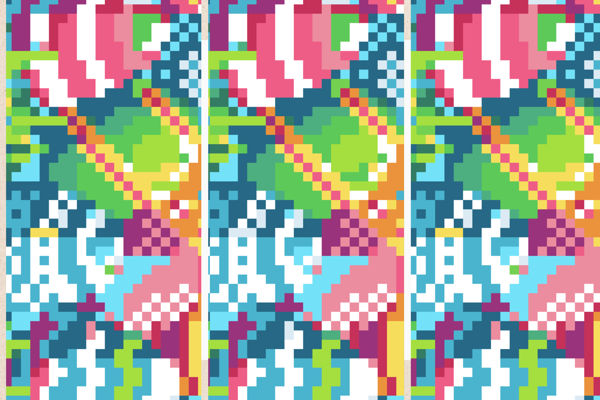

# Glancer-JS

## Highlight

Before going any further, let's give a try to spot, among three images on this folder: `src/test-images`, which two images of them are same and which two are different?



Not so easy, right?

This project — based on rest-api, lets you compare them using [open-cv](https://opencv.org/), given any two images. Furthermore, it also lets you set the tolerance by which the difference between them will be considered either pass or fail.

### Sample Request

```curl
    curl --location 'https://www.qualityplus.io/api/glance?threshold=0.5' \
    --header 'content-type: multipart/form-data' \
    --form 'images=@"/path/to/snapshot/im-3.png"' \
    --form 'images=@"/path/to/snapshot/im-4.png"'
```

### Sample Response

```json
{
    "threshold": 0.5,
    "match": false,
    "mean_squared_err": 43.22
}
```

### Java Client

```java
package io.qualityplus.clients;

public class GlancingResponse {
    public double threshold;
    public boolean match;
    public double mean_squared_err;
}

```

```java

package io.qualityplus.clients;

import jakarta.ws.rs.client.Client;
import jakarta.ws.rs.client.ClientBuilder;
import jakarta.ws.rs.client.Entity;
import jakarta.ws.rs.core.Response;
import org.glassfish.jersey.media.multipart.FormDataMultiPart;
import org.glassfish.jersey.media.multipart.MultiPart;
import org.glassfish.jersey.media.multipart.file.FileDataBodyPart;
import java.io.File;
import java.io.IOException;

public class GlancingClient {
    private static final String BASE_URI = "https://www.qualityplus.io/api/glance";
    private final Client client = ClientBuilder.newClient();
    public GlancingResponse glanceImages(String img1, String img2, float threshold) {
        FileDataBodyPart image1 = new FileDataBodyPart("images", new File(img1));
        FileDataBodyPart image2 = new FileDataBodyPart("images", new File(img2));
        Response response;
        try (MultiPart multipartEntity = new FormDataMultiPart().bodyPart(image1)
                .bodyPart(image2)) {
            response = client.target(BASE_URI)
                    .queryParam("threshold", String.valueOf(threshold))
                    .request()
                    .post(Entity.entity(multipartEntity, multipartEntity.getMediaType()));
        } catch (IOException e) {
            throw new RuntimeException(e);
        }
        client.close();
        return response.readEntity(GlancingResponse.class);
    }
}

```

### Test example

```java
public class GlancingTest {
    GlancingClient client = new GlancingClient();
    @Test(description = "Compare images")
    public void glanceImages() {
        GlancingResponse response = client.glanceImages("snapshots/image-3.png",
                "snapshots/image-4.png", 5);
        System.out.printf("Threshold: %s, Match: %s, Mean Squared Error: %s%n",
                response.threshold,
                response.match,
                response.mean_squared_err);
        Assert.assertTrue(response.match, "the given images are matched!");
    }
}

```